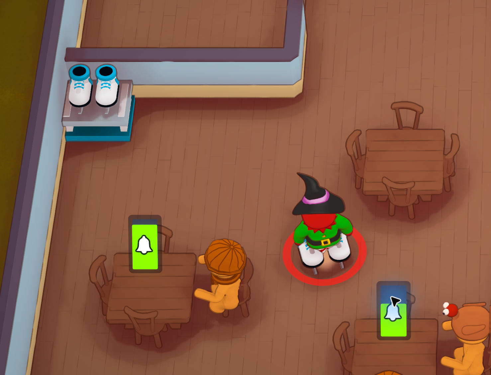
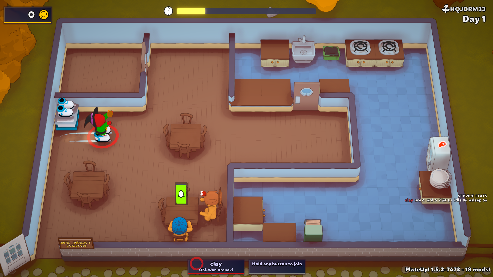

# Ice Skates

Ice Skates is a Workshop-era PlateUp! mod that adds a personal equipment tool for one slippery chef. Equipping the skates increases top speed and lowers turning responsiveness with a small momentum model. The goal is funny, skillful overshooting in tight kitchens, not full physics chaos.

Version `0.3.1`: fixes missing ground streaks while retaining the faster skating and white/cyan feet-only boots from 0.3.0. See [VERIFICATION.md](VERIFICATION.md) for repair history and testing scope.

## Screenshots

Equipped skates and the provider rack, captured by Clay:



Two fading ground streaks in the live restaurant verification:



Both images show the actual mod in PlateUp. The second screenshot also contains the separate Hot Potato and Service Stats HUD mods; neither is bundled or required by Ice Skates.

## Download

Source: [cschubiner/plateup-ice-skates](https://github.com/cschubiner/plateup-ice-skates).

For a prebuilt local installation, get the ZIP from [GitHub Releases](https://github.com/cschubiner/plateup-ice-skates/releases). Extract its `IceSkates` folder into the game's `Mods` directory with PlateUp closed. Subscribe to [KitchenLib](https://steamcommunity.com/sharedfiles/filedetails/?id=2898069883) and [HarmonyX](https://steamcommunity.com/sharedfiles/filedetails/?id=2898033283). Do not load both a local copy and a Workshop copy of Ice Skates at the same time.

## Current stack

- Modern PlateUp Workshop mod workflow, following Aragami's PlateUp Mod Template shape.
- KitchenLib for GDO registration and Workshop-era custom objects.
- Harmony for the small player movement patch.
- Local testing from the PlateUp `Mods` folder.
- Workshop publishing through `PlateUp_Data/ModUploader.exe`.

Compatibility reviewed September 10, 2026: installed Steam build `24651854`, KitchenLib `0.10.1`, and the installed HarmonyX Workshop assembly. Game references are taken from this installation, not redistributed or copied from an old template.

- [Official modding wiki](https://wiki.plateupgame.com/en/Modding/GettingStarted): local `Mods` folder testing and `ModUploader.exe` publishing.
- [Aragami's Workshop template](https://github.com/Aragami-delp/PlateUpModTemplate): Workshop quickstart with KitchenLib and Harmony.
- [KitchenLib 0.10.1 release](https://github.com/KitchenMods/KitchenLib/releases/tag/v0.10.1): dependency shaping moved into the attachment stage; this mod resolves the item there.

## Playing

A free rack parcel arrives during restaurant prep, not in HQ. Open the parcel before starting service. Move the rack with the normal prep controls. During service or practice, take a pair to equip the native hands-free tool, then use the rack to return it. In regular prep, native grab controls move the appliance instead of dispensing equipment. One pair per chef; all chefs may use the same unlimited rack. It occupies the game's tool slot, so remove another tool first. Food can still be carried. This is item-based equipment, not an invisible appliance toggle.

The rack uses normal appliance pickup rules: movable during prep, fixed during service. If removed, a replacement parcel arrives during prep. Existing racks and unopened parcels prevent duplicates.

## Project layout

- `src/IceSkates.Core`: pure rules and configuration. This project has no PlateUp dependency.
- `src/IceSkates.Workshop`: PlateUp/KitchenLib integration, GDOs, systems, and Harmony patch.
- `tests/IceSkates.Core.Tests`: automated tests for the pure logic/configuration layer.
- `content`: Workshop content folder where the built mod DLL is copied when local deploy is enabled.
- `scripts`: helper scripts for build, tests, and opening the uploader.

## Architecture

`SkateRules` owns movement tuning and math. In the Workshop adapter its smoothed vector represents normalized steering/force, not physical velocity. PlateUp's existing Rigidbody drag and collision handling remain in charge. The default `1.65` multiplier scales movement force (25% higher than v0.2); achieved in-game speed depends on native drag and other game modifiers. Steering response is now `3.8`, still below the normal `7.5` rule baseline.

`SkateEquipmentState` owns pure equip/reset state for host diagnostics. It does not drive client movement. The patched `PlayerHoldingSubview.UpdateData` uses PlateUp's already-networked `UsingToolID` to update a `SkateMotion` component on the appropriate player view. Only the owning client applies skate movement; normal position replication remains unchanged.

`IceSkatesDefinitionFactory` centralizes appliance/item configuration expectations: starter/free/unique provider, prep-movable, day-locked, interactable, and per-player non-persistent item behavior.

`IceSkatesItem` defines the equippable tool with `CEquippableTool`.

`PropertyFactory` constructs real native properties. The provider's serialized default item is set with `EditorCreateProvider`, because assigning only `ProvidedItem` is lost when native ECS attachment runs. `PrefabFactory` caches inactive, persistent templates using the native `Simple Flat` shader and its actual `_Color0` property; held variants have no active colliders. Models have rounded toes, ankle cuffs, crossed laces, dark soles, blade supports, and curved steel runners.

`SkateItemVisibility` hides only the native skate item mesh while it is parented to a player; the separate wearable model remains visible on their feet. Removing the native item from the player restores its loose-item rendering. Food and other tools are not touched. `TrailFactory` creates two short ground-aligned trails. `SkateMotion` follows the owning chef's native walking root (the player view for remote chefs). `SkateTrailRules` arms emission on actual movement and keeps it enabled across idle render frames; Unity samples by distance and expires old points. Turning emission off on each stationary render frame can miss physics-step movement. Trails follow the root's floor height and rendering layer, rather than assuming world Y=0. Streaks are cosmetic and do not change floor friction. Pause, unequip, disable, teleport, and lifecycle resets clear their history.

`EnsureIceSkatesProviderSystem` is a `RestaurantSystem` that delivers a normal free appliance parcel to an available post tile during prep. It checks existing appliances, pending creation requests, and `CLetterAppliance` parcels before delivering. It waits if no safe tile exists. PlateUp owns opening, placement, pickup, and tool transfers.

`TrackEquippedSkatesSystem` logs authoritative tool-slot transitions; the networked view, not this host-only cache, activates movement.

`PlayerWalkingComponentPatch` replaces walking movement only while that specific player is equipped. It keeps the normal PlateUp walking code for everyone else.

`ResetSkatesOnLifecycleSystem` clears cached state and steering on day/mode transitions. View disable/destruction, forced teleports, pause, disconnected/captured input, and unequip also clear steering. Day transitions may retain native equipped tools; their momentum is reset. Leaving the restaurant disables the visible skate state.

## Build and test

Install a .NET 9 SDK (tests target `net9.0`) and subscribe to KitchenLib and HarmonyX in the PlateUp Workshop. The mod targets `net472`, its pure core targets `netstandard2.0`. Framework reference assemblies are restored by NuGet. The build reads the installed game/KitchenLib/Harmony assemblies and bundles only the two Ice Skates DLLs plus metadata. It does not reference every subscribed Workshop mod or deploy during compilation.

Run unit tests:

```powershell
.\scripts\Test.ps1
```

If your PowerShell execution policy blocks local scripts, use:

```powershell
powershell -NoProfile -ExecutionPolicy Bypass -File .\scripts\Test.ps1
```

Build the Workshop mod DLL and copy it into `content`:

```powershell
.\scripts\Build.ps1
```

If your PlateUp or KitchenLib paths differ, pass them explicitly:

```powershell
.\scripts\Build.ps1 `
  -PlateUpGameFolder "D:\SteamLibrary\steamapps\common\PlateUp\PlateUp" `
  -KitchenLibWorkshopDll "C:\Program Files (x86)\Steam\steamapps\workshop\content\1599600\2898069883\KitchenLib-Workshop.dll"
```

For local testing, install this repo's `content` folder into PlateUp's local `Mods\IceSkates\content` folder. Make sure you are subscribed to KitchenLib and Harmony in the Steam Workshop.

Or install the current build directly into a local mod folder:

```powershell
.\scripts\Install-Local.ps1
```

Then verify the local install:

```powershell
.\scripts\Smoke-Test-LocalInstall.ps1
```

Close PlateUp before installing. The installer refuses to modify files while the game is running, backs up previous Ice Skates install folders under `artifacts`, and checks SHA256 hashes after copying. It does not update or remove other mods. Alternate library paths can be set in `Local.props`; `HarmonyWorkshopDll` can also be passed as an MSBuild property.

Run opt-in checks in the actual Unity runtime with PlateUp closed:

```powershell
.\scripts\Test-Runtime.ps1
```

This launches the game, writes a dedicated log in `artifacts`, waits for `SELFTEST PASS` or failure, and closes only the process it launched. It runs native provider attachment, parcel and tool-transfer operations in an isolated ECS world, inspects prefab/material properties, and verifies Harmony patches are installed. It does not start a restaurant or modify save data. Other installed mods can still produce unrelated boot errors in the same log.

Add `-VisualCheck` to render the actual boot, rack, and streak assets through Unity to `artifacts/visual-0.3.1`. The streak test drives the real `SkateMotion` component across an opaque floor, including idle frames between movement steps, a translated stage, and a separate walking root. It compares rendered pixels with the trails hidden, verifies fading after stopping, and checks pause/teleport cleanup. Mesh existence alone is not sufficient to pass. These isolated renders are not restaurant playthrough screenshots. Native tests also check hiding the hand-item mesh, restoring loose-item visibility, keeping foot models visible, and clearing the two trail histories.

For an opt-in real-game screenshot, launch PlateUp with `--iceskates-trail-capture`, equip skates, and move. The first actual chef with at least 12 trail points triggers one screenshot under `%USERPROFILE%/AppData/LocalLow/It's Happening/PlateUp/IceSkatesChecks/0.3.1/live-streaks.png`. This flag does not equip, move, or save anything automatically. Normal play never captures screenshots.

For Workshop publishing, open:

```powershell
.\scripts\Open-ModUploader.ps1
```

Then select this project folder, the folder that contains `content`.

## Tuning guide

Edit `src/IceSkates.Core/SkateTuning.cs`.

- `DefaultSpeedMultiplier`: raise for faster skates, lower toward `1.0` for safer movement.
- `DefaultSkateTurnResponsiveness`: lower for more drift while steering, higher for tighter turns.
- `DefaultCoastResponsiveness`: lower for longer slide after releasing input, higher for quicker stop.
- `DefaultMaximumDeltaTime`: caps large frame spikes so a hitch does not create a giant movement jump.
- `DefaultFacingDegreesPerSecond`: visual facing speed (default `360`); steering inertia is controlled separately above.
- `SkateTrailRules.Lifetime` and `Width`: trail duration (default `1.15` seconds) and width (`0.11`); `MinimumSpeed` gates initial emission. `PointSpacing` (`0.025`) filters tiny movements; `GroundOffset` (`0.055`) lifts strokes just above the chef's floor plane.

Recommended first tuning passes:

- More slippery: speed `1.38`, skate turn `2.6`, coast `1.2`.
- More controlled: speed `1.22`, skate turn `4.2`, coast `2.4`.

## Automated testing scope

An optional GitHub Actions template is provided in `docs/ci-tests.example.yml`. CI is not enabled by this release; the publishing credential did not have GitHub's workflow permission. Local test commands above remain available.

Unit tests cover:

- speed multiplier calculation
- turn responsiveness and inertia outputs
- equip/unequip/toggle/reset state transitions
- cleanup of missing/despawned players
- fallback/default tuning values
- appliance/item property shaping
- starter/free/unique provider configuration
- zero/invalid delta time, non-finite input and tuning, analog magnitude, release-to-stop, and frame-rate independence of the pure steering rule

The 42 unit tests do not prove live in-game feel, input bindings, native interaction routing, parcel placement, or multiplayer synchronization. The opt-in Unity checks exercise real game code, but are also not a substitute for the manual checklist below. In particular, remote-client and couch-co-op gameplay must still be tested together.

## Manual QA checklist

- One Ice Skates parcel arrives in restaurant prep; no rack spawns in HQ and no duplicates arrive while it remains unopened.
- Open the parcel: the Ice Skates appliance appears correctly with supported materials.
- The appliance is movable during prep.
- The appliance locks when the day starts.
- The appliance is interactable.
- A player can equip Ice Skates.
- Exactly one pair is visible, on the feet only; there is no floating or hand-held duplicate.
- Boots are white/cyan with distinct metal blades, not brown counter-colored blocks.
- Two ground-level ice streaks appear when skating, fade when stopped, and never stretch across teleports.
- The equipped player feels faster and slipperier.
- Other players are not affected.
- Test both host and remote client, and two local controllers; each chef's equipped state and visible skates agree on every screen.
- Carry food while equipped; an occupied tool slot prevents replacing another tool accidentally.
- Turning produces readable drift without becoming uncontrollable.
- Dropping/removing skates restores normal movement.
- State clears after day transitions.
- State clears after returning to HQ.
- State clears after restart/reset.
- State clears after player despawn/removal.
- No stale skating state remains after reconnects.
- No log errors appear on boot or use.
